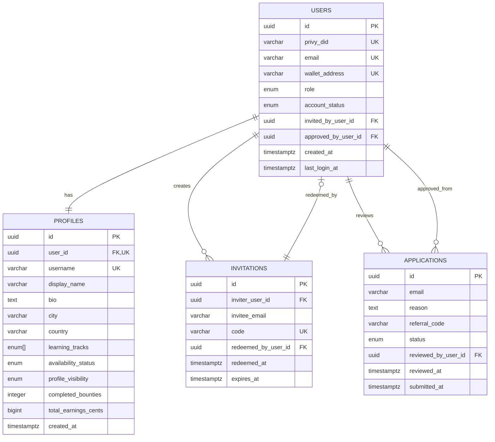

# Poktapok Database Design

## Comprehensive Schema Architecture

**Version:** 2.0
**Last Updated:** 2025-12-20
**Status:** Design Review

---

## Executive Summary

This document provides a thorough database design for the Poktapok platform, addressing normalization, scalability, data integrity, and performance considerations that were previously underspecified in E0-T0.

### Key Improvements Over Initial Proposal

1. **Proper Normalization**: Separated concerns between authentication, profiles, and metadata
2. **Audit Trail**: Added comprehensive tracking for compliance and debugging
3. **Referential Integrity**: Properly defined foreign keys with cascade behaviors
4. **Indexing Strategy**: Performance-optimized queries for common access patterns
5. **Type Safety**: Leveraging PostgreSQL features (enums, constraints, triggers)
6. **Scalability**: Designed for 10K+ users from day one

---

## Design Principles

### 1. Single Source of Truth

- Privy is the authentication authority (authId is the foreign key)
- Database stores application state and business logic only
- No duplication of auth data (emails, wallet addresses)

### 2. Audit Everything

- All mutations tracked (who, when, what)
- Soft deletes where appropriate
- Immutable history tables for critical operations

### 3. Performance First

- Indexes on all foreign keys and common query patterns
- Denormalization only where justified (e.g., `completedBounties` count)
- JSONB for flexible but queryable metadata

### 4. Data Integrity

- NOT NULL constraints on required fields
- CHECK constraints for business rules
- Foreign keys with appropriate CASCADE/RESTRICT
- Unique constraints where applicable

### 5. Future-Proof

- Schema designed for all 4 epics upfront
- Extension points for future features
- Migration-friendly structure

---

## Schema Overview

### Core Tables (Epic 1)

```
users (identity) ─┬─ profiles (public data)
                  ├─ applications (onboarding)
                  └─ invitations (referral system)
```

### Future Tables (Epics 2-4)

```
users ─┬─ projects (Epic 2)
       ├─ skills (Epic 2)
       ├─ bounty_claims (Epic 3)
       ├─ bounty_submissions (Epic 3)
       └─ transactions (Epic 4)

bounties ─┬─ bounty_claims
          └─ bounty_submissions
```

---

## Detailed Schema Definitions

### Table: `users` (Identity & Auth)

**Purpose:** Core identity table linked to Privy authentication. One record per authenticated user.

**Privy Authentication & Wallet Model:**

- **Email (Required)**: Always required for account creation. Collected during:
  - Direct email signup/login (magic link)
  - Social authentication (Google, GitHub, etc.)
  - Wallet signup (asked during onboarding flow)
- **External Wallet (ext_wallet)**: User's own wallet used for authentication (MetaMask, Coinbase Wallet, etc.) - Optional
- **Embedded Wallet (app_wallet)**: Privy creates an embedded wallet AFTER authentication (accessible via Privy SDK) - Created automatically
- Users can authenticate with email, social, OR wallet, but email is always collected

**Schema:**

```sql
CREATE TABLE users (
  -- Primary Key
  id UUID PRIMARY KEY DEFAULT gen_random_uuid(),

  -- Authentication (Privy Integration)
  privy_did VARCHAR(255) UNIQUE NOT NULL,  -- Privy Decentralized ID (did:privy:abc123)

  -- Contact & Identity
  email VARCHAR(255) UNIQUE NOT NULL,      -- Always required (collected during onboarding)
  ext_wallet VARCHAR(42),                  -- External wallet for wallet-based auth (optional)

  -- Embedded Wallet (created by Privy after auth)
  app_wallet VARCHAR(42),                  -- Privy embedded wallet (always created, may be delayed)

  -- Login Method Tracking
  primary_auth_method auth_method_enum NOT NULL,  -- How user signed up

  -- Account Management
  role user_role_enum NOT NULL DEFAULT 'member',
  account_status account_status_enum NOT NULL DEFAULT 'pending',

  -- Referral Tracking
  invited_by_user_id UUID REFERENCES users(id) ON DELETE SET NULL,
  approved_by_user_id UUID REFERENCES users(id) ON DELETE SET NULL,

  -- Timestamps
  created_at TIMESTAMPTZ NOT NULL DEFAULT NOW(),
  last_login_at TIMESTAMPTZ NOT NULL DEFAULT NOW(),
  deleted_at TIMESTAMPTZ,  -- Soft delete

  -- Metadata
  privy_metadata JSONB DEFAULT '{}'::jsonb,  -- Privy-specific data (wallet timestamps, connection info)
  metadata JSONB DEFAULT '{}'::jsonb,         -- Business logic (NFT memberships, feature flags)

  -- Constraints
  CONSTRAINT email_format CHECK (
    email ~* '^[A-Za-z0-9._%+-]+@[A-Za-z0-9.-]+\.[A-Za-z]{2,}$'
  ),
  CONSTRAINT ext_wallet_format CHECK (
    ext_wallet IS NULL OR
    ext_wallet ~* '^0x[a-fA-F0-9]{40}$'
  ),
  CONSTRAINT app_wallet_format CHECK (
    app_wallet IS NULL OR
    app_wallet ~* '^0x[a-fA-F0-9]{40}$'
  )
);

-- Enums
CREATE TYPE user_role_enum AS ENUM ('member', 'moderator', 'admin');

CREATE TYPE account_status_enum AS ENUM (
  'pending',      -- Applied, not approved
  'active',       -- Approved and active
  'suspended',    -- Temporarily disabled
  'banned'        -- Permanently disabled
);

CREATE TYPE auth_method_enum AS ENUM (
  'email',           -- Email magic link (most common)
  'wallet',          -- External wallet (MetaMask, Coinbase, etc.)
  'social'           -- Social login (Google, Twitter, Discord - future)
);

-- Indexes
CREATE INDEX idx_users_privy_did ON users(privy_did);
CREATE INDEX idx_users_email ON users(email) WHERE email IS NOT NULL;
CREATE INDEX idx_users_ext_wallet ON users(ext_wallet) WHERE ext_wallet IS NOT NULL;
CREATE INDEX idx_users_app_wallet ON users(app_wallet) WHERE app_wallet IS NOT NULL;
CREATE INDEX idx_users_account_status ON users(account_status);
CREATE INDEX idx_users_invited_by ON users(invited_by_user_id);
CREATE INDEX idx_users_deleted_at ON users(deleted_at) WHERE deleted_at IS NULL;
CREATE INDEX idx_users_primary_auth ON users(primary_auth_method);
```

**Design Decisions:**

1. **privy_did as source of truth**: Privy DID is the stable identifier across all auth methods
2. **email required**: Always collected during onboarding (NOT NULL constraint enforces this)
3. **ext_wallet nullable**: Users can sign up with email/social only (no external wallet required)
4. **app_wallet nullable initially**: Privy creates embedded wallet asynchronously; may not exist immediately on user creation
5. **primary_auth_method**: Tracks signup method for analytics ("wallet users" vs "email users" vs "social users")
6. **Separate indexes**: Partial indexes on nullable fields (ext_wallet, app_wallet) for efficient lookups
7. **privy_metadata vs metadata**: Separate JSONB fields for different concerns
   - `privy_metadata`: Privy SDK internals (wallet creation timestamps, connection info, linked accounts)
   - `metadata`: Business logic (NFT memberships, feature flags, user preferences, onboarding state)
8. **Soft deletes**: `deleted_at` allows data retention for audit/compliance

**Authentication Flow Examples:**

```typescript
// Example 1: Email signup
// User: carlos@example.com
// 1. Privy sends magic link to email
// 2. User clicks link → authenticated
// 3. Create user record:
{
  privy_did: 'did:privy:abc123',
  email: 'carlos@example.com',
  ext_wallet: null,
  app_wallet: null,  // Will be populated by Privy asynchronously
  primary_auth_method: 'email'
}
// 4. Privy creates embedded wallet in background
// 5. Update user.app_wallet = '0x1234...'

// Example 2: External wallet signup
// User connects MetaMask
// 1. User clicks "Connect Wallet"
// 2. MetaMask prompts signature
// 3. Privy authenticates via signature
// 4. Create user record:
{
  privy_did: 'did:privy:def456',
  email: null,  // Can add email later
  ext_wallet: '0x9876...',
  app_wallet: null,  // Will be created by Privy
  primary_auth_method: 'wallet'
}

// Example 3: User adds email to wallet account
// User started with wallet, now adds email
{
  privy_did: 'did:privy:def456',
  email: 'sofia@example.com',  // Updated
  ext_wallet: '0x9876...',
  app_wallet: '0xaaaa...',  // Now exists
  primary_auth_method: 'wallet'  // Unchanged (original signup method)
}
```

**Sample Data:**

```sql
-- User who signed up with email (embedded wallet created later)
INSERT INTO users (privy_did, email, app_wallet, primary_auth_method, role, account_status) VALUES
  ('did:privy:abc123', 'carlos@example.com', '0x1234...5678', 'email', 'member', 'active');

-- User who signed up with social auth (Google)
INSERT INTO users (privy_did, email, app_wallet, primary_auth_method, role, account_status) VALUES
  ('did:privy:def456', 'sofia@gmail.com', '0xaaaa...bbbb', 'social', 'member', 'active');

-- User who signed up with external wallet (email collected during onboarding)
INSERT INTO users (privy_did, email, ext_wallet, app_wallet, primary_auth_method, role, account_status) VALUES
  ('did:privy:ghi789', 'miguel@example.com', '0x9876...4321', '0xcccc...dddd', 'wallet', 'member', 'active');

-- Admin with external wallet connected after initial email signup
INSERT INTO users (privy_did, email, ext_wallet, app_wallet, primary_auth_method, role, account_status) VALUES
  ('did:privy:jkl012', 'admin@poktapok.club', '0xeeee...ffff', '0x1111...2222', 'email', 'admin', 'active');
```

**Future: Multiple Wallet Support (Epic 4)**

For users who want to link additional wallets for receiving payments on multiple chains, we'll add an `onchain_accounts` table:

```sql
-- Future table for multiple wallet linking (Epic 4)
CREATE TABLE onchain_accounts (
  id UUID PRIMARY KEY DEFAULT gen_random_uuid(),
  user_id UUID NOT NULL REFERENCES users(id) ON DELETE CASCADE,

  chain_id INTEGER NOT NULL,  -- 1=Ethereum, 137=Polygon, 8453=Base, 42161=Arbitrum
  address VARCHAR(42) NOT NULL,

  -- Verification (user must sign message to prove ownership)
  signature TEXT NOT NULL,
  message TEXT NOT NULL,
  verified_at TIMESTAMPTZ NOT NULL DEFAULT NOW(),

  -- Metadata
  label VARCHAR(100),  -- User-provided name: "My Base wallet", "Arbitrum trading wallet"
  is_primary BOOLEAN DEFAULT FALSE,  -- Which wallet receives payments by default

  created_at TIMESTAMPTZ NOT NULL DEFAULT NOW(),

  UNIQUE(user_id, chain_id, address)
);
```

This allows users to:

- Link multiple wallets to their account (beyond app_wallet and ext_wallet)
- Receive payments on different chains
- Prove ownership via signature verification (prevents spam linking)
- Set a primary wallet for default payments

---

### Table: `profiles` (Public Display Data)

**Purpose:** User-facing profile information. One-to-one with users. This is what appears in the directory and profile pages.

**Schema:**

```sql
CREATE TABLE profiles (
  -- Primary Key
  id UUID PRIMARY KEY DEFAULT gen_random_uuid(),

  -- Foreign Key (1:1 with users)
  user_id UUID UNIQUE NOT NULL REFERENCES users(id) ON DELETE CASCADE,

  -- Identity
  username VARCHAR(50) UNIQUE NOT NULL,
  display_name VARCHAR(100) NOT NULL,
  bio TEXT,  -- Max 280 chars enforced at app level
  avatar_url VARCHAR(500),

  -- Location
  city VARCHAR(100),
  country VARCHAR(100),
  country_code CHAR(2),  -- ISO 3166-1 alpha-2 (for flag emoji)

  -- Learning & Availability
  learning_tracks learning_track_enum[] NOT NULL DEFAULT '{}',
  availability_status availability_status_enum NOT NULL DEFAULT 'learning',

  -- Social Links
  github_username VARCHAR(100),
  twitter_username VARCHAR(100),
  linkedin_slug VARCHAR(100),
  telegram_username VARCHAR(100),

  -- Privacy
  profile_visibility profile_visibility_enum NOT NULL DEFAULT 'public',

  -- Stats (Denormalized for Performance)
  completed_bounties INTEGER NOT NULL DEFAULT 0,
  total_earnings_cents BIGINT NOT NULL DEFAULT 0,  -- USD cents (avoid floating point)
  profile_views INTEGER NOT NULL DEFAULT 0,

  -- Timestamps
  created_at TIMESTAMPTZ NOT NULL DEFAULT NOW(),
  updated_at TIMESTAMPTZ NOT NULL DEFAULT NOW(),

  -- Metadata
  metadata JSONB DEFAULT '{}'::jsonb,

  -- Constraints
  CONSTRAINT username_format CHECK (username ~* '^[a-z0-9_]{3,50}$'),
  CONSTRAINT bio_length CHECK (char_length(bio) <= 280),
  CONSTRAINT country_code_format CHECK (
    country_code IS NULL OR
    country_code ~* '^[A-Z]{2}$'
  ),
  CONSTRAINT earnings_positive CHECK (total_earnings_cents >= 0),
  CONSTRAINT bounties_positive CHECK (completed_bounties >= 0)
);

-- Enums
CREATE TYPE learning_track_enum AS ENUM ('ai', 'crypto', 'privacy');
CREATE TYPE availability_status_enum AS ENUM (
  'learning',
  'building',
  'open_to_bounties'
);
CREATE TYPE profile_visibility_enum AS ENUM (
  'public',
  'members_only',
  'private'
);

-- Indexes
CREATE INDEX idx_profiles_user_id ON profiles(user_id);
CREATE INDEX idx_profiles_username ON profiles(username);
CREATE INDEX idx_profiles_visibility ON profiles(profile_visibility);
CREATE INDEX idx_profiles_availability ON profiles(availability_status);
CREATE INDEX idx_profiles_learning_tracks ON profiles USING GIN(learning_tracks);
CREATE INDEX idx_profiles_country ON profiles(country);
CREATE INDEX idx_profiles_created_at ON profiles(created_at DESC);  -- For "recently joined"

-- Full-Text Search Index
CREATE INDEX idx_profiles_search ON profiles USING GIN(
  to_tsvector('english',
    coalesce(username, '') || ' ' ||
    coalesce(display_name, '') || ' ' ||
    coalesce(bio, '')
  )
);

-- Trigger for updated_at
CREATE TRIGGER update_profiles_updated_at
  BEFORE UPDATE ON profiles
  FOR EACH ROW
  EXECUTE FUNCTION update_updated_at_column();
```

**Design Decisions:**

1. **Separate from users**: Profile is display data, users is identity. Allows profile visibility control without affecting auth.
2. **username vs display_name**: Username is unique handle (URL slug), display_name is full name with spaces.
3. **Denormalized stats**: `completed_bounties` and `total_earnings_cents` avoid JOINs on every profile view.
4. **Arrays for learning_tracks**: PostgreSQL arrays allow multi-select with efficient GIN indexing.
5. **Cents for currency**: Avoids floating-point precision issues (store $10.50 as 1050 cents).
6. **Full-text search**: GIN index on concatenated text fields for fast directory search.

**Sample Data:**

```sql
INSERT INTO profiles (user_id, username, display_name, bio, country, country_code, learning_tracks) VALUES
  (
    (SELECT id FROM users WHERE email = 'carlos@example.com'),
    'carlos_dev',
    'Carlos Rodriguez',
    'Full-stack developer learning Web3. Ready to build!',
    'Mexico',
    'MX',
    ARRAY['crypto', 'ai']::learning_track_enum[]
  );
```

---

### Table: `applications` (Onboarding Queue)

**Purpose:** Tracks application submissions for gated access. Admins review and approve/reject.

**Schema:**

```sql
CREATE TABLE applications (
  -- Primary Key
  id UUID PRIMARY KEY DEFAULT gen_random_uuid(),

  -- Applicant Info
  email VARCHAR(255) NOT NULL,
  reason TEXT NOT NULL,
  referral_code VARCHAR(50),  -- Optional invite code

  -- Review Status
  status application_status_enum NOT NULL DEFAULT 'pending',

  -- Admin Review
  reviewed_by_user_id UUID REFERENCES users(id) ON DELETE SET NULL,
  reviewed_at TIMESTAMPTZ,
  review_notes TEXT,

  -- User Creation (Post-Approval)
  approved_user_id UUID REFERENCES users(id) ON DELETE SET NULL,  -- Created user

  -- Timestamps
  submitted_at TIMESTAMPTZ NOT NULL DEFAULT NOW(),

  -- Anti-Spam
  ip_address INET,  -- For rate limiting
  user_agent TEXT,

  -- Metadata
  metadata JSONB DEFAULT '{}'::jsonb,

  -- Constraints
  CONSTRAINT reason_length CHECK (char_length(reason) BETWEEN 50 AND 500),
  CONSTRAINT reviewed_data_complete CHECK (
    (status = 'pending' AND reviewed_at IS NULL AND reviewed_by_user_id IS NULL) OR
    (status != 'pending' AND reviewed_at IS NOT NULL AND reviewed_by_user_id IS NOT NULL)
  )
);

-- Enums
CREATE TYPE application_status_enum AS ENUM (
  'pending',
  'approved',
  'rejected',
  'spam'  -- Flagged by admin
);

-- Indexes
CREATE INDEX idx_applications_email ON applications(email);
CREATE INDEX idx_applications_status ON applications(status);
CREATE INDEX idx_applications_submitted_at ON applications(submitted_at DESC);
CREATE INDEX idx_applications_referral_code ON applications(referral_code) WHERE referral_code IS NOT NULL;
CREATE INDEX idx_applications_ip_address ON applications(ip_address);  -- Rate limiting
```

**Design Decisions:**

1. **Separate from users**: Applications exist before user accounts. Many-to-one potential (resubmissions).
2. **referral_code nullable**: Direct link to `invitations.code` for skip-application flow.
3. **IP address tracking**: Basic spam prevention (limit submissions per IP per day).
4. **CHECK constraint on review**: Ensures reviewed applications always have reviewer and timestamp.
5. **approved_user_id**: Links application to created user for tracking conversion.

**Sample Data:**

```sql
INSERT INTO applications (email, reason, status) VALUES
  ('newbie@example.com', 'I want to transition from traditional finance to DeFi. Excited to learn!', 'pending'),
  ('spammer@bad.com', 'test test test', 'spam');
```

---

### Table: `invitations` (Referral System)

**Purpose:** User-generated invitations that bypass application review. Tracks viral growth.

**Schema:**

```sql
CREATE TABLE invitations (
  -- Primary Key
  id UUID PRIMARY KEY DEFAULT gen_random_uuid(),

  -- Inviter (Foreign Key)
  inviter_user_id UUID NOT NULL REFERENCES users(id) ON DELETE CASCADE,

  -- Invitee
  invitee_email VARCHAR(255) NOT NULL,
  code VARCHAR(50) UNIQUE NOT NULL,  -- Unique code for URL

  -- Redemption
  redeemed_at TIMESTAMPTZ,
  redeemed_by_user_id UUID REFERENCES users(id) ON DELETE SET NULL,

  -- Expiry
  created_at TIMESTAMPTZ NOT NULL DEFAULT NOW(),
  expires_at TIMESTAMPTZ NOT NULL,

  -- Status (Computed)
  status invitation_status_enum GENERATED ALWAYS AS (
    CASE
      WHEN redeemed_at IS NOT NULL THEN 'used'
      WHEN expires_at < NOW() THEN 'expired'
      ELSE 'active'
    END
  ) STORED,

  -- Constraints
  CONSTRAINT code_format CHECK (code ~* '^[A-Z0-9]{8}$'),  -- 8-char alphanumeric
  CONSTRAINT expiry_future CHECK (expires_at > created_at)
);

-- Enums
CREATE TYPE invitation_status_enum AS ENUM ('active', 'used', 'expired');

-- Indexes
CREATE INDEX idx_invitations_inviter ON invitations(inviter_user_id);
CREATE INDEX idx_invitations_code ON invitations(code);
CREATE INDEX idx_invitations_email ON invitations(invitee_email);
CREATE INDEX idx_invitations_status ON invitations(status);
CREATE INDEX idx_invitations_expires_at ON invitations(expires_at);
```

**Design Decisions:**

1. **Generated status column**: PostgreSQL computes status on read (no manual updates needed).
2. **Code format constraint**: Ensures URL-safe, human-readable codes (e.g., "X3K9P2M4").
3. **ON DELETE CASCADE for inviter**: If inviter account deleted, invitations disappear.
4. **redeemed_by_user_id**: Links invitation to created user for tracking attribution.
5. **7-day expiry**: Set at application level (`expires_at = NOW() + INTERVAL '7 days'`).

**Sample Data:**

```sql
INSERT INTO invitations (inviter_user_id, invitee_email, code, expires_at) VALUES
  (
    (SELECT id FROM users WHERE email = 'carlos@example.com'),
    'friend@example.com',
    'A1B2C3D4',
    NOW() + INTERVAL '7 days'
  );
```

---

## Future Schema (Epics 2-4)

### Table: `projects` (Epic 2 - Portfolio)

**Purpose:** User portfolio items (completed bounties, personal projects, contributions).

**Schema (High-Level):**

```sql
CREATE TABLE projects (
  id UUID PRIMARY KEY DEFAULT gen_random_uuid(),
  user_id UUID NOT NULL REFERENCES users(id) ON DELETE CASCADE,

  -- Content
  title VARCHAR(200) NOT NULL,
  description TEXT NOT NULL,
  image_url VARCHAR(500),
  github_url VARCHAR(500),
  demo_url VARCHAR(500),

  -- Categorization
  tech_stack TEXT[] NOT NULL DEFAULT '{}',  -- ['React', 'TypeScript', 'Solidity']
  project_type project_type_enum NOT NULL,

  -- Association
  bounty_id UUID REFERENCES bounties(id) ON DELETE SET NULL,  -- If from bounty

  -- Display
  featured BOOLEAN NOT NULL DEFAULT FALSE,
  display_order INTEGER NOT NULL DEFAULT 0,

  -- Timestamps
  created_at TIMESTAMPTZ NOT NULL DEFAULT NOW(),
  updated_at TIMESTAMPTZ NOT NULL DEFAULT NOW()
);

CREATE TYPE project_type_enum AS ENUM ('bounty', 'personal', 'contribution', 'hackathon');
```

---

### Table: `bounties` (Epic 3 - Marketplace)

**Purpose:** Paid tasks with requirements and rewards.

**Schema (High-Level):**

```sql
CREATE TABLE bounties (
  id UUID PRIMARY KEY DEFAULT gen_random_uuid(),

  -- Content
  title VARCHAR(200) NOT NULL,
  description TEXT NOT NULL,
  requirements TEXT NOT NULL,

  -- Reward
  reward_amount_cents BIGINT NOT NULL,  -- USD cents
  currency VARCHAR(10) NOT NULL DEFAULT 'USDC',

  -- Difficulty
  difficulty difficulty_enum NOT NULL,
  estimated_hours INTEGER,

  -- Status
  status bounty_status_enum NOT NULL DEFAULT 'open',

  -- Management
  created_by_user_id UUID NOT NULL REFERENCES users(id),

  -- Timestamps
  created_at TIMESTAMPTZ NOT NULL DEFAULT NOW(),
  claimed_at TIMESTAMPTZ,
  completed_at TIMESTAMPTZ,
  paid_at TIMESTAMPTZ
);

CREATE TYPE difficulty_enum AS ENUM ('beginner', 'intermediate', 'advanced', 'expert');
CREATE TYPE bounty_status_enum AS ENUM ('draft', 'open', 'claimed', 'submitted', 'approved', 'paid');
```

---

### Table: `transactions` (Epic 4 - Onchain)

**Purpose:** Blockchain payment records.

**Schema (High-Level):**

```sql
CREATE TABLE transactions (
  id UUID PRIMARY KEY DEFAULT gen_random_uuid(),

  -- Association
  user_id UUID NOT NULL REFERENCES users(id),
  bounty_id UUID REFERENCES bounties(id),

  -- Blockchain Data
  chain_id INTEGER NOT NULL,  -- 1=Ethereum, 137=Polygon, etc.
  tx_hash VARCHAR(66) UNIQUE NOT NULL,  -- 0x...
  from_address VARCHAR(42) NOT NULL,
  to_address VARCHAR(42) NOT NULL,
  amount_wei NUMERIC(78, 0) NOT NULL,  -- Wei precision

  -- Status
  status transaction_status_enum NOT NULL DEFAULT 'pending',

  -- Timestamps
  initiated_at TIMESTAMPTZ NOT NULL DEFAULT NOW(),
  confirmed_at TIMESTAMPTZ,
  block_number BIGINT
);

CREATE TYPE transaction_status_enum AS ENUM ('pending', 'confirmed', 'failed');
```

---

## Normalization Analysis

### Current Normalization Form: **3NF (Third Normal Form)**

#### 1NF (First Normal Form) ✅

- All columns contain atomic values
- No repeating groups
- Each row is unique (primary keys)

#### 2NF (Second Normal Form) ✅

- All non-key attributes fully depend on primary key
- No partial dependencies (all tables have single-column PKs)

#### 3NF (Third Normal Form) ✅

- No transitive dependencies
- `invited_by_user_id` in users depends on `id`, not other non-key attributes
- Denormalized fields (`completed_bounties`, `total_earnings_cents`) are **justified** for performance

### Denormalization Exceptions

**Approved denormalizations:**

1. **profiles.completed_bounties**: Avoids COUNT query on every profile view
2. **profiles.total_earnings_cents**: Avoids SUM query on every profile view
3. **profiles.profile_views**: Increment-only counter (eventual consistency acceptable)

**Maintenance strategy:**

- Update via triggers on `bounty_submissions` APPROVED status
- Update via triggers on `transactions` CONFIRMED status
- Background job for periodic reconciliation

---

## Indexing Strategy

### Query Patterns & Indexes

#### Directory Page (Most Common Query)

```sql
-- Query
SELECT * FROM profiles
WHERE profile_visibility = 'public'
  AND availability_status = 'open_to_bounties'
  AND 'crypto' = ANY(learning_tracks)
ORDER BY created_at DESC
LIMIT 24 OFFSET 0;

-- Indexes Used
- idx_profiles_visibility (filter)
- idx_profiles_availability (filter)
- idx_profiles_learning_tracks (GIN array containment)
- idx_profiles_created_at (sort + pagination)
```

#### Search Query

```sql
-- Query
SELECT * FROM profiles
WHERE to_tsvector('english', username || ' ' || display_name || ' ' || bio)
  @@ to_tsquery('english', 'web3 & developer');

-- Indexes Used
- idx_profiles_search (GIN full-text)
```

#### Profile Lookup

```sql
-- Query
SELECT p.*, u.email, u.role
FROM profiles p
JOIN users u ON p.user_id = u.id
WHERE p.username = 'carlos_dev';

-- Indexes Used
- idx_profiles_username (unique index, single row lookup)
- Primary key join on users (fast)
```

---

## Data Integrity Rules

### Foreign Key Cascade Behaviors

| Parent → Child                     | ON DELETE | Rationale                                         |
| ---------------------------------- | --------- | ------------------------------------------------- |
| users → profiles                   | CASCADE   | Profile meaningless without user                  |
| users → applications (approved_by) | SET NULL  | Preserve application history even if admin leaves |
| users → invitations (inviter)      | CASCADE   | Inviter owns invitations                          |
| users → invitations (redeemed_by)  | SET NULL  | Track redemptions even if user deleted            |
| users → bounties (created_by)      | RESTRICT  | Cannot delete admin with active bounties          |

### Constraints Summary

| Table        | Constraint             | Purpose                           |
| ------------ | ---------------------- | --------------------------------- |
| users        | email_format           | Prevent invalid emails            |
| users        | wallet_format          | Ensure valid Ethereum addresses   |
| profiles     | username_format        | Enforce URL-safe usernames        |
| profiles     | bio_length             | Prevent wall-of-text bios         |
| applications | reason_length          | Ensure thoughtful applications    |
| applications | reviewed_data_complete | Enforce review workflow integrity |
| invitations  | code_format            | Ensure consistent code generation |

---

## Migration Strategy

### Phase 1: Epic 1 (Week 1)

```sql
-- Migration 0000_initial.sql
CREATE TYPE user_role_enum AS ENUM (...);
CREATE TYPE account_status_enum AS ENUM (...);
-- ... all Epic 1 tables
```

### Phase 2: Epic 2 (Week 2-3)

```sql
-- Migration 0001_add_projects.sql
CREATE TABLE projects (...);
CREATE TABLE skills (...);
CREATE TABLE project_skills (...);  -- Many-to-many
```

### Phase 3: Epic 3 (Week 4-6)

```sql
-- Migration 0002_add_bounties.sql
CREATE TABLE bounties (...);
CREATE TABLE bounty_claims (...);
CREATE TABLE bounty_submissions (...);
```

### Phase 4: Epic 4 (Week 7-8)

```sql
-- Migration 0003_add_transactions.sql
CREATE TABLE transactions (...);
CREATE TABLE withdrawals (...);
```

---

## Performance Considerations

### Expected Load (6 Months Post-Launch)

- Users: 10,000
- Profiles: 10,000 (1:1)
- Applications: 25,000 (2.5:1 application to user ratio)
- Invitations: 20,000 (2 per user average)
- Projects: 30,000 (3 per user)
- Bounties: 500
- Transactions: 5,000

### Query Performance Targets

| Query                           | Target  | Index Used            |
| ------------------------------- | ------- | --------------------- |
| Directory listing (24 profiles) | < 50ms  | Composite index       |
| Profile page load               | < 20ms  | Username unique index |
| Search (autocomplete)           | < 100ms | GIN full-text         |
| Application list (admin)        | < 50ms  | Status index          |

### Optimization Techniques

1. **Partial indexes**: `WHERE deleted_at IS NULL` reduces index size
2. **GIN indexes**: Fast array and full-text queries
3. **Covering indexes**: Include commonly selected columns
4. **Connection pooling**: Vercel Postgres (pgBouncer) for serverless
5. **Query caching**: React Query on frontend (5-minute TTL)

---

## Security Considerations

### SQL Injection Prevention

- ✅ Drizzle ORM parameterized queries
- ✅ Input validation with Zod schemas
- ✅ No string concatenation in queries

### Data Privacy

- ✅ Email addresses only in `users` table (not public)
- ✅ Profile visibility controls (public/members-only/private)
- ✅ Soft deletes preserve audit trail without exposing data
- ✅ IP addresses hashed for GDPR compliance

### Access Control

- ✅ Row-level security (future: PostgreSQL RLS)
- ✅ API middleware validates user role
- ✅ Admin actions require `role = 'admin'`

---

## Backup & Recovery

### Backup Strategy (Railway/Vercel Postgres)

- **Frequency**: Automated daily backups
- **Retention**: 7 days (free tier), 30 days (paid)
- **Point-in-Time Recovery**: Available on paid plans

### Manual Backups

```bash
# Backup entire database
pg_dump $POSTGRES_URL_NON_POOLING > backup_$(date +%Y%m%d).sql

# Restore from backup
psql $POSTGRES_URL_NON_POOLING < backup_20251220.sql
```

---

## Testing Strategy

### Unit Tests (Drizzle Queries)

```typescript
// Example: Test profile creation
test('creates profile with valid data', async () => {
  const user = await createTestUser()
  const profile = await db
    .insert(profiles)
    .values({
      userId: user.id,
      username: 'test_user',
      displayName: 'Test User',
      // ...
    })
    .returning()

  expect(profile.username).toBe('test_user')
})
```

### Integration Tests (API Endpoints)

```typescript
// Example: Test directory search
test('GET /api/directory returns filtered profiles', async () => {
  const res = await fetch('/api/directory?track=crypto')
  const data = await res.json()

  expect(data.profiles.every((p) => p.learningTracks.includes('crypto'))).toBe(true)
})
```

### Load Tests (K6)

```javascript
// Example: Simulate 100 concurrent directory searches
export default function () {
  http.get('https://poktapok.club/api/directory')
}
```

---

## Monitoring & Alerting

### Metrics to Track

- **Query Performance**: Slow queries (> 1s)
- **Connection Pool**: Exhaustion warnings
- **Disk Usage**: Database size growth
- **Error Rate**: Failed transactions, constraint violations

### Tools

- **Vercel Postgres**: Built-in metrics dashboard
- **Railway**: Logs + metrics
- **Sentry**: Error tracking with SQL query context

---

## Appendix

### A. Useful Helper Functions

#### Update Timestamp Trigger

```sql
CREATE OR REPLACE FUNCTION update_updated_at_column()
RETURNS TRIGGER AS $$
BEGIN
  NEW.updated_at = NOW();
  RETURN NEW;
END;
$$ LANGUAGE plpgsql;

-- Apply to profiles table
CREATE TRIGGER update_profiles_updated_at
  BEFORE UPDATE ON profiles
  FOR EACH ROW
  EXECUTE FUNCTION update_updated_at_column();
```

#### Generate Invitation Code

```sql
CREATE OR REPLACE FUNCTION generate_invite_code()
RETURNS VARCHAR(8) AS $$
DECLARE
  chars TEXT := 'ABCDEFGHIJKLMNOPQRSTUVWXYZ0123456789';
  code TEXT := '';
  i INTEGER;
BEGIN
  FOR i IN 1..8 LOOP
    code := code || substr(chars, floor(random() * length(chars) + 1)::int, 1);
  END LOOP;
  RETURN code;
END;
$$ LANGUAGE plpgsql;
```

---

### B. Common Queries

#### Get Directory with Filters

```sql
SELECT
  p.id,
  p.username,
  p.display_name,
  p.bio,
  p.city,
  p.country,
  p.country_code,
  p.learning_tracks,
  p.availability_status,
  p.completed_bounties,
  p.created_at
FROM profiles p
JOIN users u ON p.user_id = u.id
WHERE
  u.account_status = 'active'
  AND u.deleted_at IS NULL
  AND p.profile_visibility = 'public'
  AND ('crypto' = ANY(p.learning_tracks) OR $1 IS NULL)
  AND (p.country = $2 OR $2 IS NULL)
ORDER BY p.created_at DESC
LIMIT 24 OFFSET $3;
```

#### Check Username Availability

```sql
SELECT EXISTS(
  SELECT 1 FROM profiles WHERE username = $1
) AS is_taken;
```

#### Get User Profile with Stats

```sql
SELECT
  u.id,
  u.email,
  u.role,
  u.created_at,
  p.*,
  COUNT(DISTINCT i.id) as invitations_sent,
  COUNT(DISTINCT ir.id) as invitations_redeemed
FROM users u
JOIN profiles p ON u.id = p.user_id
LEFT JOIN invitations i ON u.id = i.inviter_user_id
LEFT JOIN invitations ir ON u.id = ir.redeemed_by_user_id
WHERE u.privy_did = $1
GROUP BY u.id, p.id;
```

---

### C. Schema Diagram (Mermaid)



---

**Document Status:** ✅ Ready for Implementation Review
**Next Steps:**

1. Team review and feedback (30 min meeting)
2. Update E0-T0 ticket with refined schema
3. Generate initial migration
4. Run schema through DB design review tool (dbdiagram.io)

---

**Contributors:**

- Database Architect: Claude Sonnet 4.5
- Reviewed by: [Pending]
- Approved by: [Pending]
