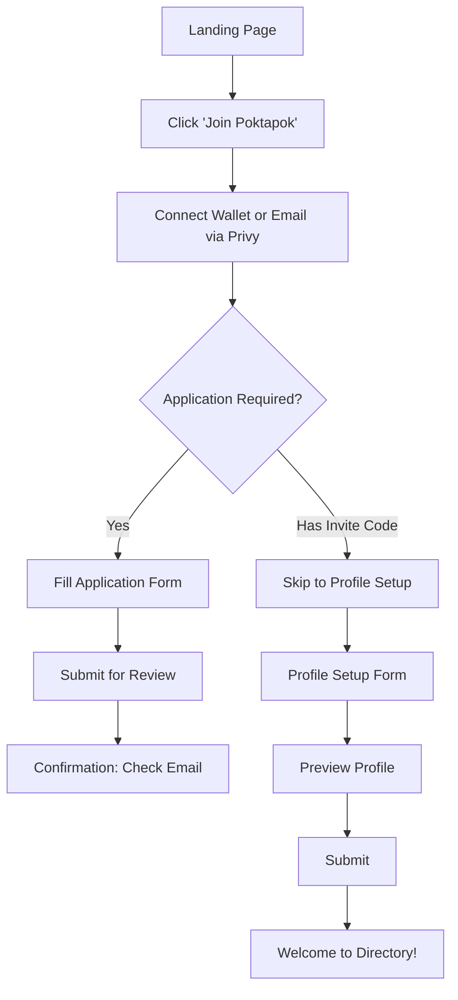
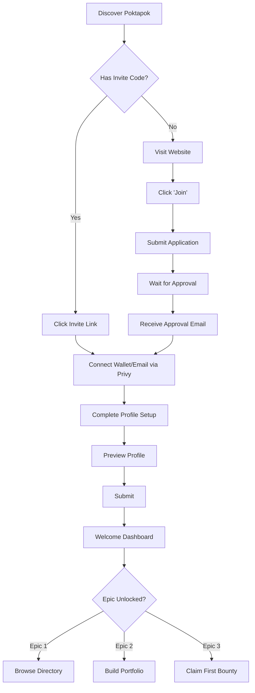
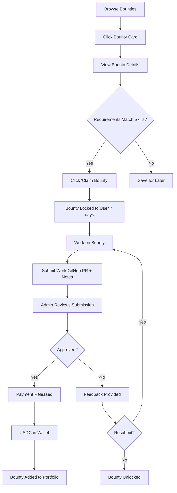
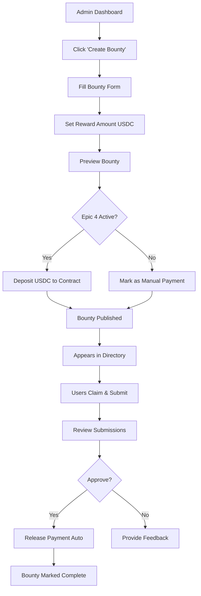

# Product Requirements Document: Poktapok
## Frutero Talent Platform MVP

**Version:** 1.0
**Last Updated:** December 2024
**Status:** In Development
**Target Launch:** 8 weeks from kickoff

---

## Executive Summary

**Poktapok** is a bounty-powered talent marketplace that helps Latin American developers earn within 3 months by learning Code: AI, Crypto/DeFi, and Privacy, through real-world challenges. Unlike traditional job boards that require corporate resumes, Poktapok enshrines builders through completed work.

**MVP Goal:** Launch a talent directory that progressively unlocks portfolio showcase, bounty marketplace, and onchain payments.

**Target Users:** College students, recent graduates, and career changers in Latin America (initially), expanding globally.

**Business Model:** Transaction fees on bounties (5-10%), company placement fees, and future premium partnerships.

---

## Product Vision

### Mission
Democratize access to global tech opportunities for Latin American talent by replacing intimidating job applications with proof of work.

### Core Value Proposition
"De cero a chamba en 3 meses" - Earn in 3 months by learning through bounties, not resumes.

### Why This Matters
Traditional hiring barriers (formal education, work history, corporate applications) exclude talented builders. Poktapok removes these barriers by letting work speak for itself.

---

## User Personas

### Primary Persona: "Carlos" - The Career Changer
- **Age:** 31
- **Background:** Economics graduate, self-teaching web development
- **Goals:** Break into tech without formal CS degree, earn while learning
- **Pain Points:** Job postings require 2+ years experience, intimidated by corporate application forms
- **Tech Savvy:** Low (knows JavaScript basics, heard about Crypto)
- **Motivation:** Economic opportunity + global remote work

### Secondary Persona: "Sofia" - The Recent Grad
- **Age:** 22
- **Background:** Computer science student (final year or just graduated)
- **Goals:** Build portfolio, gain practical experience beyond academic projects
- **Pain Points:** Lack of real-world projects to showcase, local job market limited
- **Tech Savvy:** High (comfortable with Git, APIs, deployment)
- **Motivation:** Skill development + proving capability

### Future Persona: "TechCorp" - The Hiring Company
- **Type:** Tech startup or Web3 company
- **Goals:** Find pre-vetted Latin American developers
- **Pain Points:** Expensive recruiters, unverified resumes, timezone/language barriers
- **Motivation:** Quality talent at competitive rates, cultural fit

---

## Epic Breakdown

### Overview
```
Epic 1: Talent Directory (Week 1) → MVP Launch
Epic 2: Portfolio (Weeks 2-3) → Showcase Work
Epic 3: Bounty Board (Weeks 4-6) → Earning Mechanism
Epic 4: Onchain Funding (Weeks 7-8) → Crypto Payments
```

---

## Epic 1: Talent Directory (Week 1)

### Objective
Create a simple, non-intimidating talent directory where users can create profiles and be discovered.

### Success Criteria
- [ ] 100 approved profiles within 2 weeks of launch
- [ ] < 3-minute average profile creation time
- [ ] < 5% spam/low-quality applications
- [ ] 30% of signups via referrals/invitations

### User Stories

#### As a Builder (User)
1. **I want to create a profile quickly** so that I can join the platform without intimidation
   - **Acceptance Criteria:**
     - Profile creation form has max 6 fields
     - Bio limited to 280 characters (Twitter-style)
     - Can complete in < 3 minutes
     - Mobile-responsive

2. **I want to showcase what I'm learning** so that companies see my potential, not just my past
   - **Acceptance Criteria:**
     - Display reputation score and current builds: challenges or projects
     - Availability status visible (learning, building, open to bounties)
     - Profile shows "joined recently" badge

3. **I want to control who sees my information** so that I feel safe sharing publicly
   - **Acceptance Criteria:**
     - Tiered visibility settings (public, registered users, verified companies)
     - Can edit visibility per profile section
     - Clear privacy indicators

#### As an Admin
4. **I want to review applications efficiently** so that I can approve quality members quickly
   - **Acceptance Criteria:**
     - Admin dashboard shows pending applications
     - One-click approve/reject with optional notes
     - Can view applicant's submitted information
     - Bulk actions available

5. **I want to invite builders directly** so that I can seed the platform with quality users
   - **Acceptance Criteria:**
     - Generate unique invite links (7-day expiry)
     - Track who invited whom
     - Limit invites per user (1-2 initially)

### Features Breakdown

#### Feature 1.1: Profile Creation Flow
**Priority:** P0 (Must Have)

**User Flow:**


**Form Fields:**
1. Username (handle, unique, 3-20 chars)
2. Display Name (full name, 2-50 chars)
3. Bio (max 280 chars, markdown supported)
4. Location (city + country dropdowns)
5. Learning Tracks (radio: AI, Crypto/DeFi, Privacy)
6. Availability Status (radio: learning, building, open to bounties)

**Optional Fields (Progressive Disclosure):**
- Social links (GitHub, Twitter, LinkedIn)
- Wallet address (auto-filled from Privy - embedded wallet)

**Validation:**
- Username: alphanumeric + underscores, no spaces
- Bio: no URLs in first version (prevent spam)
- Location: autocomplete from preset list

**UI/UX:**
- Single-page form (no multi-step wizard)
- Real-time validation feedback
- Character count for bio
- Preview before submit

---

#### Feature 1.2: Public Directory
**Priority:** P0 (Must Have)

**Layout:**
- Card-based grid (3 columns desktop, 1 column mobile)
- Each card shows:
  - Avatar (generated from username or uploaded)
  - Username + display name
  - Bio (truncated to 100 chars)
  - Location (city, country flag)
  - Learning tracks (badges)
  - Availability status (colored indicator)

**Search & Filters:**
- Search bar (username, display name, bio)
- Filter by:
  - Learning track (AI-Crypto/DeFi-Privacy)
  - Availability status
  - Location (country)
  - Join date (newest first)

**Sorting:**
- Default: Recently joined
- Options: Alphabetical, Most active (future)

**Pagination:**
- 24 profiles per page
- Infinite scroll on mobile

---

#### Feature 1.3: Profile Page
**Priority:** P0 (Must Have)

**Tiered Visibility:**

**Public (Anyone):**
- Username, display name, avatar
- Bio
- Location
- Learning tracks
- Join date
- Availability status

**Registered Users:**
- All of public +
- Social links (if added)
- "Send message" button (future)

**Verified Companies (Epic 2+):**
- All of registered +
- Email (for contact)
- Completed bounties count
- Full portfolio

**Actions:**
- Edit profile (if own profile)
- Share profile (copy link)
- Report profile (spam/abuse)

---

#### Feature 1.4: Application System
**Priority:** P0 (Must Have)

**Application Form:**
- Email (required, verified)
- Reason for joining (textarea, 50-500 chars)
- Referral code (optional, if invited)

**Admin Review Dashboard:**
- Table view of pending applications
- Columns: Email, reason, submitted date
- Actions: Approve, Reject, View details
- Bulk actions: Approve selected, Delete spam
- Status indicators: Pending, Approved, Rejected

**Approval Flow:**
1. Admin approves → user receives email with login link
2. User clicks link → redirected to profile setup
3. Completes profile → appears in directory

---

#### Feature 1.5: Invitation System
**Priority:** P1 (Should Have)

**For Inviters:**
- "Invite Friends" button on dashboard
- Enter invitee email
- System generates unique code (8 chars, alphanumeric)
- Code valid for 7 days
- Track invite status (sent, used, expired)

**For Invitees:**
- Receive email with invite link
- Click link → skip application, go directly to profile setup
- Profile shows "Invited by @username"

**Limits:**
- Standard users: 2 invites
- Power users (completed 3+ bounties): 5 invites
- Admins: Unlimited

---

### Technical Specifications

#### Database Schema (Drizzle ORM)

**Users Table:**
```typescript
{
  id: uuid (PK)
  username: varchar(50) unique
  displayName: varchar(100)
  bio: text (max 280)
  city: varchar(100)
  country: varchar(100)
  learningTracks: enum[] (ai, crypto, privacy)
  availabilityStatus: enum (learning, building, open-to-bounties)
  walletAddress: varchar(42) nullable
  email: varchar(255) unique
  privyUserId: varchar(255) unique
  profileVisibility: varchar(20) default 'public'
  socialLinks: jsonb nullable
  joinedAt: timestamp
  lastActiveAt: timestamp
  invitedBy: uuid nullable (FK users.id)
  approvedBy: uuid nullable (FK users.id)
}
```

**Applications Table:**
```typescript
{
  id: uuid (PK)
  email: varchar(255)
  reason: text
  referralCode: varchar(50) nullable
  status: enum (pending, approved, rejected)
  submittedAt: timestamp
  reviewedAt: timestamp nullable
  reviewedBy: uuid nullable (FK users.id)
  reviewNotes: text nullable
}
```

**Invitations Table:**
```typescript
{
  id: uuid (PK)
  inviterId: uuid (FK users.id)
  inviteeEmail: varchar(255)
  code: varchar(50) unique
  usedAt: timestamp nullable
  usedBy: uuid nullable (FK users.id)
  createdAt: timestamp
  expiresAt: timestamp
}
```

#### API Endpoints

**Public:**
- `GET /api/directory` - List profiles (with filters/search)
- `GET /api/profile/:username` - View profile (respects visibility)
- `POST /api/apply` - Submit application

**Authenticated:**
- `GET /api/me` - Get own profile
- `PUT /api/me` - Update own profile
- `POST /api/invitations` - Create invitation
- `GET /api/invitations/me` - List own invitations

**Admin:**
- `GET /api/admin/applications` - List pending applications
- `POST /api/admin/applications/:id/approve` - Approve application
- `POST /api/admin/applications/:id/reject` - Reject application
- `GET /api/admin/users` - List all users (with filters)

#### Authentication Flow (Privy)
1. User clicks "Join" → Privy modal opens
2. Options: Connect wallet OR email login
3. If wallet: Auto-connect via Wagmi
4. If email: Privy sends magic link
5. On success: Check if user exists in DB
6. If new: Redirect to application/profile setup
7. If existing: Redirect to dashboard

---

### UI/UX Design Principles

**1. Mobile-First**
- 90% of target users are on phones
- Touch targets min 44px
- Forms optimized for mobile keyboards

**2. Non-Intimidating**
- Conversational copy ("Tell us about yourself" vs "Professional Summary")
- Progress indicators
- Clear error messages
- Encouraging micro-copy

**3. Visual Hierarchy**
- Bold avatars and usernames
- Learning track badges (color-coded)
- Availability status (green/yellow/blue indicators)

**4. Fast & Responsive**
- < 2s page loads
- Optimistic UI updates
- Skeleton loaders

---

### Out of Scope for Epic 1
- ❌ Portfolio uploads (Epic 2)
- ❌ Bounty listings (Epic 3)
- ❌ Messaging between users
- ❌ Company profiles
- ❌ Advanced search (semantic, AI-powered)
- ❌ Reputation/badges system
- ❌ Mobile app (responsive web sufficient)

---

## Epic 2: Portfolio Showcase (Weeks 2-3)

### Objective
Enable users to showcase completed bounties, personal projects, and skills in a visual portfolio.

### Key Features (High-Level)

#### Feature 2.1: Portfolio Builder
- Add projects (title, description, tech stack, links)
- Upload images/screenshots (Cloudinary or similar)
- Embed GitHub repos (auto-fetch README)
- YouTube video embeds

#### Feature 2.2: Skills & Endorsements
- Add skills (autocomplete from preset list)
- Skill levels (beginner, intermediate, advanced)
- Peer endorsements (future: requires trust network)

#### Feature 2.3: Enhanced Profile Page
- Portfolio section below bio
- Project cards with thumbnails
- Filter by tech stack or category

#### Feature 2.4: Portfolio Analytics (Admin View)
- Track profile views
- Most viewed projects
- Skills distribution across platform

### Success Metrics
- 60% of users add at least 1 project within first week
- Average 3 projects per portfolio
- 80% include GitHub links

### Technical Additions
- **New Tables:** `projects`, `skills`, `project_skills`
- **New API Endpoints:** `/api/projects`, `/api/skills`
- **File Storage:** Cloudinary integration for images

---

## Epic 3: Bounty Marketplace (Weeks 4-6)

### Objective
Create a marketplace where users can claim, complete, and submit bounties for crypto payment.

### Key Features (High-Level)

#### Feature 3.1: Bounty Listings
- Browse available bounties (card grid)
- Filter by difficulty, tech stack, reward amount
- Bounty detail page (description, requirements, reward)

#### Feature 3.2: Claim & Submit Flow
1. User claims bounty (locks for 7 days)
2. User works on bounty
3. User submits (GitHub PR link + notes)
4. Admin reviews submission
5. Admin approves → payment flow triggers

#### Feature 3.3: Bounty Management (Admin)
- Create bounty (form with title, description, reward, difficulty)
- Review submissions
- Approve/reject with feedback
- Track bounty analytics (claim rate, completion rate)

#### Feature 3.4: User Dashboard
- My bounties (claimed, in progress, submitted, completed)
- Earnings summary
- Next recommended bounties

### Success Metrics
- 70% of available bounties claimed within 48 hours
- 60% submission → approval rate
- Average 2 weeks to first bounty completion per user
- $10K+ in bounties paid in first 3 months

### Technical Additions
- **New Tables:** `bounties`, `bounty_submissions`, `bounty_claims`
- **State Machine:** Bounty status (available → claimed → submitted → approved → paid)
- **Admin Panel:** Submission review interface

---

## Epic 4: Onchain Funding (Weeks 7-8)

### Objective
Enable transparent, automated crypto payments via smart contracts.

### Key Features (High-Level)

#### Feature 4.1: Smart Contract Escrow
- Deploy escrow contract on Ethereum Sepolia (testnet)
- Admin deposits USDC when creating bounty
- Contract releases payment on approval

#### Feature 4.2: Multi-Chain Support
- Add Monad, Base, Polygon, Arbitrum (mainnet)
- User selects preferred chain for payment
- Display gas fees before withdrawal

#### Feature 4.3: Payment Dashboard
- Pending earnings
- Withdrawal history
- Transaction receipts (Etherscan links)

#### Feature 4.4: Fiat Offramp (Future)
- Partner with Coinbase/MoonPay
- Convert USDC to local currency
- Bank transfer integration

### Success Metrics
- 100% of bounties paid via smart contract
- Zero payment disputes
- < $5 average gas fees per payment
- 90% successful withdrawal rate

### Technical Additions
- **Smart Contract:** Solidity escrow contract (audited)
- **Web3 Integration:** Wagmi for contract interaction
- **New Tables:** `transactions`, `withdrawals`

---

## User Flows (Mermaid Diagrams)

### Flow 1: New User Onboarding



### Flow 2: Claiming and Completing a Bounty (Epic 3)



### Flow 3: Admin Bounty Creation (Epic 3)



---

## Success Metrics & KPIs

### Epic 1: Talent Directory
| Metric | Target | Measurement |
|--------|--------|-------------|
| Approved Profiles | 100 in 2 weeks | Database count |
| Profile Creation Time | < 3 minutes avg | Analytics tracking |
| Application Quality | < 5% spam | Manual review |
| Referral Rate | 30% via invites | Invitation tracking |
| Mobile Traffic | > 70% | Google Analytics |

### Epic 2: Portfolio
| Metric | Target | Measurement |
|--------|--------|-------------|
| Portfolio Completion | 60% of users | Database query |
| Projects per Portfolio | 3+ average | Database avg |
| GitHub Links | 80% include | Database filter |
| Profile Views | 500+/week | Analytics |

### Epic 3: Bounty Board
| Metric | Target | Measurement |
|--------|--------|-------------|
| Claim Rate | 70% within 48h | Time-to-claim tracking |
| Completion Rate | 60% submissions approved | Status transitions |
| Time to First Bounty | 2 weeks average | User journey tracking |
| Total Payouts | $10K+ in 3 months | Transaction sum |

### Epic 4: Onchain Funding
| Metric | Target | Measurement |
|--------|--------|-------------|
| Smart Contract Payments | 100% of bounties | Payment method filter |
| Payment Disputes | 0 | Support tickets |
| Gas Fees | < $5 average | Blockchain data |
| Withdrawal Success | 90%+ | Transaction logs |

### Platform-Wide (3 Months)
| Metric | Target | Measurement |
|--------|--------|-------------|
| Monthly Active Users | 500+ | Login tracking |
| User Retention | 50% MAU/WAU | Cohort analysis |
| NPS Score | 60+ | User surveys |
| Geographic Reach | 5+ LATAM cities | User location data |

---

## Technical Architecture

### System Architecture Diagram

```
┌─────────────────────────────────────────────────────────────┐
│                     FRONTEND (Next.js 16)                    │
├─────────────────────────────────────────────────────────────┤
│  Pages          Components       State Management            │
│  ├─ Directory   ├─ ProfileCard  ├─ Zustand (global)        │
│  ├─ Profile     ├─ BountyCard   └─ React Query (server)    │
│  ├─ Dashboard   └─ Forms                                     │
│  └─ Admin                                                    │
└────────────────────────┬────────────────────────────────────┘
                         │ API Calls (fetch)
┌────────────────────────▼────────────────────────────────────┐
│                    API LAYER (Next.js)                       │
├─────────────────────────────────────────────────────────────┤
│  Routes                   Middleware                         │
│  ├─ /api/directory        ├─ Auth (Privy)                   │
│  ├─ /api/profiles         ├─ Rate Limiting                  │
│  ├─ /api/bounties         ├─ Validation (Zod)               │
│  └─ /api/admin            └─ Error Handling                 │
└────────────────────────┬────────────────────────────────────┘
                         │ ORM Queries
┌────────────────────────▼────────────────────────────────────┐
│               DATABASE (PostgreSQL @ Railway)                │
├─────────────────────────────────────────────────────────────┤
│  Tables (Drizzle ORM)                                        │
│  ├─ users                                                    │
│  ├─ applications                                             │
│  ├─ invitations                                              │
│  ├─ projects (Epic 2)                                        │
│  ├─ bounties (Epic 3)                                        │
│  └─ transactions (Epic 4)                                    │
└─────────────────────────────────────────────────────────────┘

┌─────────────────────────────────────────────────────────────┐
│                   WEB3 LAYER (Epic 4)                        │
├─────────────────────────────────────────────────────────────┤
│  Privy (Auth)      Wagmi (Blockchain)      Smart Contracts  │
│  ├─ Wallet Login   ├─ Read Contract        ├─ Escrow.sol   │
│  ├─ Social Auth    ├─ Write Contract       └─ USDC Token   │
│  └─ User Session   └─ Transaction Status                    │
└─────────────────────────────────────────────────────────────┘
```

### Tech Stack Decisions

| Category | Technology | Rationale |
|----------|------------|-----------|
| **Frontend** | Next.js 16 | Server Components, App Router, built-in optimizations |
| **UI Library** | React 19 | Latest features, better performance |
| **Styling** | Tailwind CSS v4 | Utility-first, fast development |
| **Components** | shadcn/ui | Accessible, customizable, Radix UI primitives |
| **State** | Zustand | Simpler than Redux, minimal boilerplate |
| **Data Fetching** | React Query | Server state management, caching, optimistic updates |
| **Database** | PostgreSQL | Relational data, proven, Railway hosting |
| **ORM** | Drizzle | TypeScript-first, SQL-like, lightweight |
| **Auth** | Privy | Web3 + social, multi-chain, good UX |
| **Blockchain** | Wagmi v3 | React hooks for Web3, type-safe |
| **Package Manager** | Bun | Faster than npm/yarn/pnpm |
| **Hosting** | Vercel | Zero-config Next.js deployment |

---

## Development Timeline

### Week 1: Epic 1 - Talent Directory
| Day | Tasks | Deliverables |
|-----|-------|--------------|
| 1-2 | Database setup, auth flow | Privy integration, DB schema |
| 3-4 | Profile creation, directory | Working forms, profile pages |
| 5-6 | Admin panel, invitations | Application review, invite system |
| 7 | Testing, deployment | Staging environment live |

### Weeks 2-3: Epic 2 - Portfolio
| Week | Tasks | Deliverables |
|------|-------|--------------|
| 2 | Portfolio builder, project CRUD | Add/edit/delete projects |
| 3 | Skills, image uploads, analytics | Full portfolio showcase |

### Weeks 4-6: Epic 3 - Bounty Board
| Week | Tasks | Deliverables |
|------|-------|--------------|
| 4 | Bounty listings, search/filter | Browse bounties |
| 5 | Claim flow, submission system | Complete claim → submit flow |
| 6 | Admin review, user dashboard | Full bounty lifecycle |

### Weeks 7-8: Epic 4 - Onchain Funding
| Week | Tasks | Deliverables |
|------|-------|--------------|
| 7 | Smart contract dev, testnet deploy | Working escrow contract |
| 8 | Payment UI, multi-chain support | Live crypto payments |

**Buffer:** 1 week for QA, bug fixes, polish

---

## Risks & Mitigations

### Risk 1: Low Application Quality
**Impact:** High spam rate, wasted admin time
**Likelihood:** Medium
**Mitigation:**
- Add simple CAPTCHA to application form
- Require email verification
- Review first 100 applications manually to spot patterns
- Implement auto-rejection criteria (profanity, gibberish)

### Risk 2: Slow User Growth
**Impact:** Empty directory, no network effects
**Likelihood:** Medium
**Mitigation:**
- Seed with 20-30 invited users before public launch
- Partner with coding bootcamps in LATAM for cohort signups
- Offer first 100 users "Founding Member" badge
- Run referral contest (most invites wins bounty credits)

### Risk 3: Smart Contract Vulnerabilities
**Impact:** Loss of funds, trust erosion
**Likelihood:** Low (with proper audit)
**Mitigation:**
- Use battle-tested escrow patterns (OpenZeppelin)
- Conduct security audit before mainnet
- Start with small bounty amounts ($10-50)
- Implement emergency pause functionality
- Keep manual payment option as fallback

### Risk 4: Gas Fees Too High
**Impact:** Users can't afford to withdraw earnings
**Likelihood:** Medium (Ethereum mainnet)
**Mitigation:**
- Default to low-fee chains (Polygon, Arbitrum, Base)
- Batch payments weekly to reduce transactions
- Subsidize gas fees for first withdrawal
- Offer fiat offramp (Coinbase Commerce) as alternative

---

## Open Questions

### Product Questions
1. **Should we allow companies to create accounts in Epic 1, or wait until Epic 2/3?**
   - Recommendation: Wait until Epic 3 (bounty board) when they have something to do

2. **What's the minimum bounty payout amount?**
   - Recommendation: $10 minimum to cover gas fees + make it worthwhile

3. **How do we handle disputes (user says approved, admin says rejected)?**
   - Recommendation: All admin actions logged, clear feedback required, 1 resubmission allowed

### Technical Questions
4. **Which blockchain should be the default for Epic 4 alpha?**
   - Options: Base (Coinbase reach), Polygon (lowest fees), Arbitrum (ecosystem)
   - Recommendation: Base for brand recognition + reasonable fees

5. **Should we use Cloudinary, S3, or Supabase Storage for image uploads?**
   - Recommendation: Start with Cloudinary (free tier, easy Next.js integration)

---

## Appendix

### A. Glossary
- **Builder:** Developer, designer, or creator using Poktapok
- **Bounty:** Paid task with specific requirements and reward
- **Claim:** Locking a bounty to work on it
- **Enshrine:** To showcase and validate talent through completed work
- **Epic:** Major product milestone (Directory, Portfolio, Bounty Board, Funding)
- **USDC:** USD Coin, a stablecoin for crypto payments

### B. References
- Superteam Earn: https://earn.superteam.fun (bounty platform inspiration)
- Privy Docs: https://docs.privy.io
- Drizzle ORM: https://orm.drizzle.team
- Wagmi Docs: https://wagmi.sh

### C. Contact
- Product Lead: k7
- Operations: Mel
- Development Team: 3 full-time developers

---

**Document Status:** ✅ Ready for Development
**Next Steps:** Epic 1 kickoff, assign tasks, daily standups

