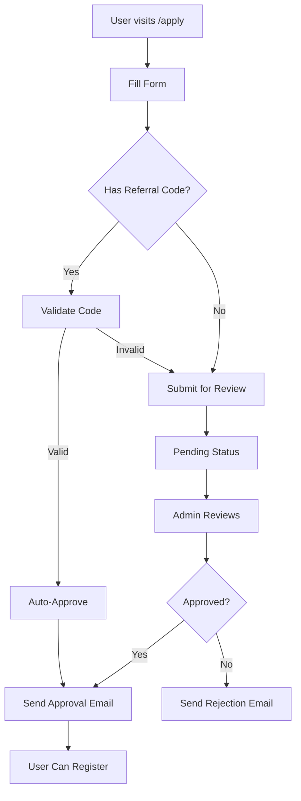

# E1-T5: Application System

**Epic:** Epic 1 - Talent Directory
**Story Points:** 5
**Status:** 🔴 Not Started
**Assignee:** Full-stack Developer
**Dependencies:** E0-T0 (Database Setup)

---

## Objective

Build application submission form and admin review dashboard for quality control.

---

## Tasks

1. [ ] Create public application form (no auth required)
2. [ ] Build admin dashboard at `/admin/applications`
3. [ ] Implement approval flow (approve → send email → user can register)
4. [ ] Add rejection flow with optional notes
5. [ ] Create email templates (approval/rejection using React Email)
6. [ ] Add simple CAPTCHA protection (hCaptcha or similar)
7. [ ] Implement admin authentication/authorization

---

## Application Form

### Location
- Public page: `/apply`
- Accessible without authentication
- Mobile-optimized design

### Form Fields

1. **Email** (required)
   - Format validation: `name@domain.com`
   - Email verification (send confirmation code)
   - Uniqueness check (prevent duplicate applications)

2. **Reason for Joining** (required)
   - Textarea, 50-500 characters
   - Placeholder: "Tell us why you want to join Poktapok..."
   - Character counter

3. **Referral Code** (optional)
   - 8-character alphanumeric
   - Validates against `invitations` table
   - If valid, auto-approves (skips review)

4. **CAPTCHA** (required)
   - hCaptcha or Cloudflare Turnstile
   - Prevents bot spam

### UX/UI
- Simple, welcoming design
- No intimidating corporate feel
- Encouraging micro-copy
- Clear success message after submission
- Mobile-responsive

---

## Files to Create/Modify

### New Files
- `src/app/apply/page.tsx` - Application form page
- `src/app/apply/success/page.tsx` - Success confirmation page
- `src/components/application/application-form.tsx` - Form component
- `src/app/admin/applications/page.tsx` - Admin dashboard
- `src/components/admin/application-table.tsx` - Applications table
- `src/components/admin/application-row.tsx` - Table row component
- `src/lib/validators/application.ts` - Zod schemas
- `src/lib/email/templates/approval.tsx` - Approval email (React Email)
- `src/lib/email/templates/rejection.tsx` - Rejection email (React Email)
- `src/lib/email/send.ts` - Email sending utilities
- `src/app/api/applications/route.ts` - POST /api/applications
- `src/app/api/admin/applications/route.ts` - GET /api/admin/applications
- `src/app/api/admin/applications/[id]/approve/route.ts` - Approval endpoint
- `src/app/api/admin/applications/[id]/reject/route.ts` - Rejection endpoint
- `src/lib/auth/admin-middleware.ts` - Admin authorization

---

## Implementation Details

### 1. Application Form Validation (`src/lib/validators/application.ts`)

```typescript
import { z } from 'zod';

export const applicationSchema = z.object({
  email: z
    .string()
    .email('Please enter a valid email address')
    .toLowerCase(),

  reason: z
    .string()
    .min(50, 'Please write at least 50 characters')
    .max(500, 'Please keep your reason under 500 characters'),

  referralCode: z
    .string()
    .length(8, 'Referral code must be 8 characters')
    .optional()
    .or(z.literal('')),

  captchaToken: z.string().min(1, 'Please complete the CAPTCHA'),
});

export type ApplicationFormData = z.infer<typeof applicationSchema>;
```

### 2. Application Submission Flow



### 3. Admin Dashboard Component (`src/app/admin/applications/page.tsx`)

```typescript
import { getApplications } from '@/lib/db/queries/applications';
import { requireAdmin } from '@/lib/auth/admin-middleware';
import ApplicationTable from '@/components/admin/application-table';

export default async function AdminApplicationsPage() {
  await requireAdmin(); // Throws if not admin

  const pendingApplications = await getApplications({ status: 'pending' });
  const recentApplications = await getApplications({ limit: 50 });

  return (
    <div className="container mx-auto px-4 py-8">
      <h1 className="text-3xl font-bold mb-8">Application Review</h1>

      <div className="mb-8">
        <h2 className="text-xl font-semibold mb-4">
          Pending Review ({pendingApplications.length})
        </h2>
        <ApplicationTable applications={pendingApplications} />
      </div>

      <div>
        <h2 className="text-xl font-semibold mb-4">Recent Applications</h2>
        <ApplicationTable applications={recentApplications} showAll />
      </div>
    </div>
  );
}
```

### 4. Application Table Component

```typescript
'use client';

import { useState } from 'react';
import { Table, TableHeader, TableBody, TableRow, TableCell } from '@/components/ui/table';
import { Button } from '@/components/ui/button';
import { Check, X, Eye } from 'lucide-react';
import { toast } from 'sonner';

export function ApplicationTable({ applications }) {
  const [loading, setLoading] = useState<string | null>(null);

  const handleApprove = async (id: string) => {
    setLoading(id);
    try {
      await fetch(`/api/admin/applications/${id}/approve`, { method: 'POST' });
      toast.success('Application approved!');
      // Refresh or remove from list
    } catch (err) {
      toast.error('Failed to approve application');
    } finally {
      setLoading(null);
    }
  };

  const handleReject = async (id: string, notes?: string) => {
    setLoading(id);
    try {
      await fetch(`/api/admin/applications/${id}/reject`, {
        method: 'POST',
        headers: { 'Content-Type': 'application/json' },
        body: JSON.stringify({ notes }),
      });
      toast.success('Application rejected');
    } catch (err) {
      toast.error('Failed to reject application');
    } finally {
      setLoading(null);
    }
  };

  return (
    <Table>
      <TableHeader>
        <TableRow>
          <TableCell>Email</TableCell>
          <TableCell>Reason</TableCell>
          <TableCell>Submitted</TableCell>
          <TableCell>Status</TableCell>
          <TableCell>Actions</TableCell>
        </TableRow>
      </TableHeader>
      <TableBody>
        {applications.map((app) => (
          <TableRow key={app.id}>
            <TableCell>{app.email}</TableCell>
            <TableCell className="max-w-xs truncate">{app.reason}</TableCell>
            <TableCell>{formatDate(app.submittedAt)}</TableCell>
            <TableCell>
              <StatusBadge status={app.status} />
            </TableCell>
            <TableCell>
              {app.status === 'pending' && (
                <div className="flex gap-2">
                  <Button
                    size="sm"
                    onClick={() => handleApprove(app.id)}
                    disabled={loading === app.id}
                  >
                    <Check className="h-4 w-4" />
                  </Button>
                  <Button
                    size="sm"
                    variant="destructive"
                    onClick={() => handleReject(app.id)}
                    disabled={loading === app.id}
                  >
                    <X className="h-4 w-4" />
                  </Button>
                  <Button size="sm" variant="ghost">
                    <Eye className="h-4 w-4" />
                  </Button>
                </div>
              )}
            </TableCell>
          </TableRow>
        ))}
      </TableBody>
    </Table>
  );
}
```

### 5. Email Templates (React Email)

**Approval Email** (`src/lib/email/templates/approval.tsx`)

```typescript
import { Html, Head, Body, Container, Text, Link, Button } from '@react-email/components';

export function ApprovalEmail({ email, registrationLink }) {
  return (
    <Html>
      <Head />
      <Body style={{ fontFamily: 'sans-serif', padding: '20px' }}>
        <Container>
          <Text style={{ fontSize: '24px', fontWeight: 'bold' }}>
            Welcome to Poktapok! 🎉
          </Text>

          <Text>
            Great news! Your application has been approved.
            You can now create your profile and join the community.
          </Text>

          <Button
            href={registrationLink}
            style={{
              background: '#000',
              color: '#fff',
              padding: '12px 24px',
              borderRadius: '6px',
              textDecoration: 'none',
            }}
          >
            Create Your Profile
          </Button>

          <Text style={{ color: '#666', fontSize: '14px', marginTop: '20px' }}>
            This link expires in 7 days.
          </Text>

          <Text style={{ color: '#666', fontSize: '14px' }}>
            Questions? Reply to this email or reach out on Twitter @poktapok
          </Text>
        </Container>
      </Body>
    </Html>
  );
}
```

**Rejection Email** (`src/lib/email/templates/rejection.tsx`)

```typescript
export function RejectionEmail({ email, notes }) {
  return (
    <Html>
      <Head />
      <Body style={{ fontFamily: 'sans-serif', padding: '20px' }}>
        <Container>
          <Text style={{ fontSize: '20px', fontWeight: 'bold' }}>
            Application Update
          </Text>

          <Text>
            Thank you for your interest in Poktapok. Unfortunately, we're
            unable to approve your application at this time.
          </Text>

          {notes && (
            <Text style={{ background: '#f5f5f5', padding: '12px', borderRadius: '6px' }}>
              {notes}
            </Text>
          )}

          <Text>
            You're welcome to apply again in the future. We're continuously
            growing and would love to have you when the time is right.
          </Text>

          <Text style={{ color: '#666', fontSize: '14px' }}>
            Questions? Reply to this email.
          </Text>
        </Container>
      </Body>
    </Html>
  );
}
```

### 6. Admin Authorization Middleware

```typescript
import { getCurrentUser } from '@/lib/auth/helpers';
import { redirect } from 'next/navigation';

export async function requireAdmin() {
  const user = await getCurrentUser();

  if (!user) {
    redirect('/');
  }

  // Check if user is admin (stored in users.role)
  if (user.role !== 'admin') {
    redirect('/');
  }

  return user;
}

export function isAdmin(user: User | null): boolean {
  return user?.role === 'admin';
}
```

---

## API Endpoints

### POST `/api/applications`

**Purpose:** Submit new application

**Request Body:**
```json
{
  "email": "user@example.com",
  "reason": "I want to learn Web3 and build projects...",
  "referralCode": "ABC123XY",
  "captchaToken": "..."
}
```

**Response:**
```json
{
  "success": true,
  "message": "Application submitted! Check your email.",
  "autoApproved": false
}
```

**Response (with valid referral):**
```json
{
  "success": true,
  "message": "Application approved! Check your email.",
  "autoApproved": true
}
```

**Error Cases:**
- 400: Validation error
- 409: Email already applied
- 429: Rate limit exceeded (5 per hour per IP)

### GET `/api/admin/applications?status=pending&limit=50`

**Purpose:** List applications (admin only)

**Response:**
```json
{
  "applications": [
    {
      "id": "uuid",
      "email": "user@example.com",
      "reason": "I want to learn...",
      "referralCode": null,
      "status": "pending",
      "submittedAt": "2025-12-20T10:00:00Z"
    }
  ],
  "total": 156
}
```

### POST `/api/admin/applications/[id]/approve`

**Purpose:** Approve application (admin only)

**Response:**
```json
{
  "success": true,
  "emailSent": true
}
```

### POST `/api/admin/applications/[id]/reject`

**Purpose:** Reject application (admin only)

**Request Body:**
```json
{
  "notes": "Optional reason for rejection"
}
```

**Response:**
```json
{
  "success": true,
  "emailSent": true
}
```

---

## Database Schema Updates

### Applications Table
```typescript
{
  id: uuid (PK)
  email: varchar(255) unique
  reason: text
  referralCode: varchar(50) nullable
  status: enum (pending, approved, rejected)
  submittedAt: timestamp
  reviewedAt: timestamp nullable
  reviewedBy: uuid nullable (FK users.id)
  reviewNotes: text nullable
  ipAddress: varchar(45) nullable (for rate limiting)
}
```

### Users Table Addition
```typescript
{
  // ... existing fields
  role: enum (user, admin) default 'user'
}
```

---

## Acceptance Criteria

- [ ] Application form validates email format
- [ ] Spam protection: CAPTCHA working
- [ ] Valid referral codes auto-approve applications
- [ ] Admin can approve in 1 click (<2s roundtrip)
- [ ] Approved users receive email with registration link
- [ ] Registration link expires in 7 days
- [ ] Admins can add review notes (visible internally only)
- [ ] Bulk actions available (approve selected, delete spam)
- [ ] Email templates render correctly (test with React Email)
- [ ] Rate limiting prevents spam (5 submissions per hour per IP)
- [ ] Duplicate emails rejected

---

## Testing

### Manual Testing Checklist

```bash
# Test 1: Submit Application (No Referral)
1. Visit /apply
2. Fill form with valid email + reason
3. Complete CAPTCHA
4. Submit
5. Should see success message
6. Check database → status should be "pending"
7. Should NOT receive approval email yet

# Test 2: Submit with Valid Referral Code
1. Create invitation in database
2. Visit /apply with referral code
3. Fill form
4. Submit
5. Should auto-approve
6. Check email → should receive approval email immediately

# Test 3: Submit with Invalid Referral Code
1. Visit /apply
2. Enter invalid referral code "12345678"
3. Submit
4. Should still submit but go to pending review

# Test 4: Admin Approval Flow
1. Log in as admin
2. Navigate to /admin/applications
3. Should see pending applications table
4. Click approve on application
5. Check database → status should be "approved"
6. Applicant should receive approval email

# Test 5: Admin Rejection Flow
1. Click reject on application
2. Enter optional notes
3. Submit
4. Status should be "rejected"
5. Applicant should receive rejection email

# Test 6: Duplicate Email Prevention
1. Submit application with email A
2. Try submitting again with same email A
3. Should show error: "You've already applied"

# Test 7: CAPTCHA Validation
1. Open /apply
2. Fill form but skip CAPTCHA
3. Submit
4. Should show error: "Please complete the CAPTCHA"

# Test 8: Rate Limiting
1. Submit 5 applications from same IP in 1 hour
2. Try 6th submission
3. Should be blocked with 429 error
```

### API Testing

```bash
# Submit application
curl -X POST http://localhost:3000/api/applications \
  -H "Content-Type: application/json" \
  -d '{
    "email":"test@example.com",
    "reason":"I want to learn Web3 and build cool projects",
    "captchaToken":"test-token"
  }'

# Admin list applications
curl "http://localhost:3000/api/admin/applications?status=pending" \
  -H "Cookie: privy-token=..."

# Approve application
curl -X POST "http://localhost:3000/api/admin/applications/UUID/approve" \
  -H "Cookie: privy-token=..."

# Reject application
curl -X POST "http://localhost:3000/api/admin/applications/UUID/reject" \
  -H "Content-Type: application/json" \
  -H "Cookie: privy-token=..." \
  -d '{"notes":"Not a good fit right now"}'
```

---

## Dependencies

### Before Starting
- [ ] E0-T0: Database Setup completed
- [ ] Email service configured (Resend, SendGrid, or similar)
- [ ] hCaptcha or Cloudflare Turnstile account
- [ ] Admin users created in database

### Blocks
- E1-T1: Authentication Integration (needs application approval check)
- E1-T6: Invitation System (invitations can skip application)

---

## Notes & Questions

### Implementation Notes
- Use React Email for templating (better than plain HTML)
- Store CAPTCHA tokens temporarily (verify once, discard)
- Log all admin actions for audit trail
- Consider adding bulk approve/reject for efficiency

### Email Service
- **Recommended:** Resend (developer-friendly, React Email integration)
- **Alternative:** SendGrid, Postmark, AWS SES
- Set up SPF/DKIM records for deliverability

### Admin Access
- **Initial admins:** Manually set `role='admin'` in database
- **Future:** Add admin invitation system (Epic 2)

### Questions
- [ ] How many admins will review applications?
  - **Decision:** Start with 2-3, scale as needed
- [ ] Should we send confirmation email on application submission?
  - **Decision:** Yes, simple "We received your application" email
- [ ] What if user loses approval email?
  - **Decision:** Add "Resend approval email" button in admin panel

### Future Enhancements (Not in Scope)
- AI-powered spam detection
- Automated approval based on criteria (LinkedIn profile quality, etc.)
- Application analytics dashboard
- Batch import applications from forms

---

**Created:** 2025-12-20
**Last Updated:** 2025-12-20
**Status Changes:**
- 2025-12-20: Created ticket
