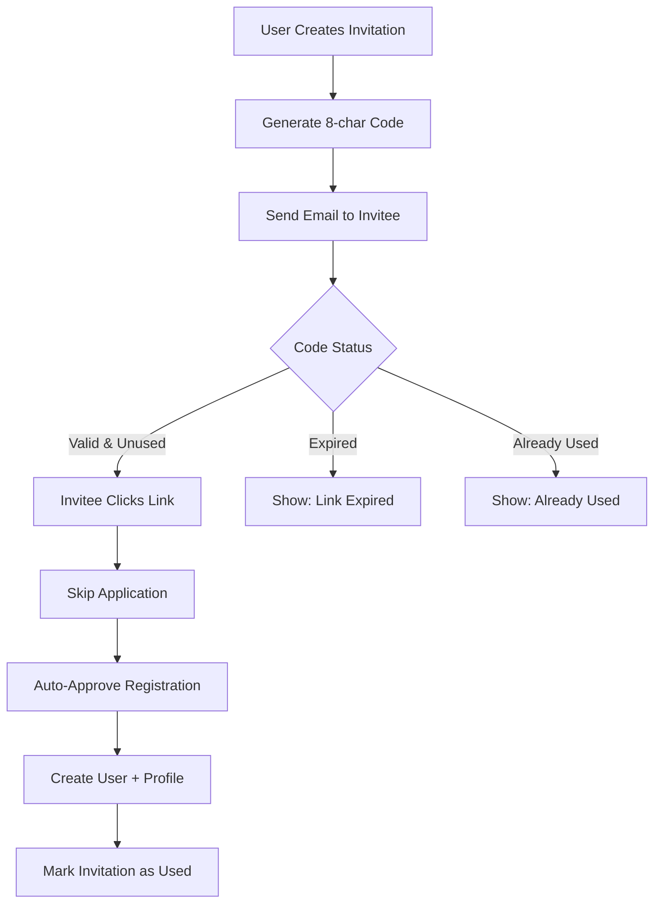

# E1-T6: Invitation System

**Epic:** Epic 1 - Talent Directory
**Story Points:** 3
**Status:** 🔴 Not Started
**Assignee:** Backend Developer
**Dependencies:** E1-T1 (Authentication), E1-T5 (Application System)

---

## Objective

Allow users to invite friends directly, bypassing the application process.

---

## Tasks

1. [ ] Create "Invite Friends" UI in user dashboard
2. [ ] Generate unique 8-char alphanumeric codes
3. [ ] Send invitation emails with link
4. [ ] Implement invite link redemption (skips application)
5. [ ] Track invitation usage and expiry (7 days)
6. [ ] Add invitation quota system
7. [ ] Display invite status (sent, used, expired)

---

## Invitation System Rules

### Invitation Limits (Quota System)

| User Type | Invitation Quota |
|-----------|------------------|
| Standard users | 2 invites |
| Power users (3+ completed bounties) | 5 invites |
| Admins | Unlimited |

### Invitation Lifecycle


---

## Files to Create/Modify

### New Files
- `src/app/dashboard/page.tsx` - Dashboard with invitation section (modify existing or create)
- `src/components/invitations/invite-form.tsx` - Invite input form
- `src/components/invitations/invite-list.tsx` - List of sent invites
- `src/components/invitations/invite-card.tsx` - Individual invite status card
- `src/app/invite/[code]/page.tsx` - Invite redemption page
- `src/lib/email/templates/invitation.tsx` - Invitation email
- `src/lib/utils/generate-code.ts` - Unique code generator
- `src/app/api/invitations/route.ts` - POST /api/invitations, GET /api/invitations/me
- `src/app/api/invitations/[code]/route.ts` - GET /api/invitations/[code] (verify)
- `src/lib/db/queries/invitations.ts` - Invitation queries

---

## Implementation Details

### 1. Invitation Code Generator (`src/lib/utils/generate-code.ts`)

```typescript
import { customAlphabet } from 'nanoid';

// Generate URL-safe alphanumeric code (no ambiguous chars: 0, O, I, l)
const generateId = customAlphabet('123456789ABCDEFGHJKLMNPQRSTUVWXYZabcdefghijkmnopqrstuvwxyz', 8);

export function generateInvitationCode(): string {
  return generateId();
}

// Example output: "aB3kM9pQ"
```

### 2. Invite Form Component (`src/components/invitations/invite-form.tsx`)

```typescript
'use client';

import { useState } from 'react';
import { Button } from '@/components/ui/button';
import { Input } from '@/components/ui/input';
import { toast } from 'sonner';
import { useRouter } from 'next/navigation';

export function InviteForm({ remainingInvites }: { remainingInvites: number }) {
  const [email, setEmail] = useState('');
  const [loading, setLoading] = useState(false);
  const router = useRouter();

  const handleSubmit = async (e: React.FormEvent) => {
    e.preventDefault();

    if (remainingInvites <= 0) {
      toast.error('You have no invites remaining');
      return;
    }

    setLoading(true);

    try {
      const res = await fetch('/api/invitations', {
        method: 'POST',
        headers: { 'Content-Type': 'application/json' },
        body: JSON.stringify({ inviteeEmail: email }),
      });

      if (!res.ok) {
        const data = await res.json();
        throw new Error(data.error || 'Failed to send invitation');
      }

      toast.success(`Invitation sent to ${email}!`);
      setEmail('');
      router.refresh(); // Refresh to update invite list
    } catch (error) {
      toast.error(error.message);
    } finally {
      setLoading(false);
    }
  };

  return (
    <form onSubmit={handleSubmit} className="flex gap-2">
      <Input
        type="email"
        placeholder="friend@example.com"
        value={email}
        onChange={(e) => setEmail(e.target.value)}
        required
      />
      <Button type="submit" disabled={loading || remainingInvites <= 0}>
        {loading ? 'Sending...' : 'Invite'}
      </Button>
      <p className="text-sm text-muted-foreground ml-2">
        {remainingInvites} invites remaining
      </p>
    </form>
  );
}
```

### 3. Invite List Component (`src/components/invitations/invite-list.tsx`)

```typescript
import { getMyInvitations } from '@/lib/db/queries/invitations';
import { InviteCard } from './invite-card';

export async function InviteList() {
  const invitations = await getMyInvitations();

  if (invitations.length === 0) {
    return (
      <p className="text-muted-foreground text-center py-8">
        You haven't sent any invitations yet
      </p>
    );
  }

  return (
    <div className="space-y-4">
      {invitations.map((invite) => (
        <InviteCard key={invite.id} invitation={invite} />
      ))}
    </div>
  );
}
```

### 4. Invite Card Component

```typescript
import { Badge } from '@/components/ui/badge';
import { Button } from '@/components/ui/button';
import { Copy, Check } from 'lucide-react';
import { useState } from 'react';

export function InviteCard({ invitation }) {
  const [copied, setCopied] = useState(false);

  const inviteUrl = `${window.location.origin}/invite/${invitation.code}`;
  const statusColor = {
    pending: 'yellow',
    used: 'green',
    expired: 'gray',
  }[invitation.status];

  const handleCopy = async () => {
    await navigator.clipboard.writeText(inviteUrl);
    setCopied(true);
    setTimeout(() => setCopied(false), 2000);
  };

  return (
    <div className="border rounded-lg p-4 flex items-center justify-between">
      <div>
        <p className="font-medium">{invitation.inviteeEmail}</p>
        <p className="text-sm text-muted-foreground">
          Sent {formatDate(invitation.createdAt)}
          {invitation.expiresAt && ` • Expires ${formatDate(invitation.expiresAt)}`}
        </p>
        {invitation.usedBy && (
          <p className="text-sm text-green-600">
            Used by @{invitation.usedBy.username}
          </p>
        )}
      </div>

      <div className="flex items-center gap-2">
        <Badge variant={statusColor}>{invitation.status}</Badge>

        {invitation.status === 'pending' && (
          <Button size="sm" variant="ghost" onClick={handleCopy}>
            {copied ? <Check className="h-4 w-4" /> : <Copy className="h-4 w-4" />}
          </Button>
        )}
      </div>
    </div>
  );
}
```

### 5. Invitation Email Template (`src/lib/email/templates/invitation.tsx`)

```typescript
import { Html, Head, Body, Container, Text, Button } from '@react-email/components';

export function InvitationEmail({
  inviterName,
  inviterUsername,
  inviteCode,
  inviteUrl,
}) {
  return (
    <Html>
      <Head />
      <Body style={{ fontFamily: 'sans-serif', padding: '20px' }}>
        <Container>
          <Text style={{ fontSize: '24px', fontWeight: 'bold' }}>
            You're Invited to Poktapok! 🎉
          </Text>

          <Text>
            <strong>{inviterName}</strong> (@{inviterUsername}) has invited you
            to join Poktapok, a talent platform for builders learning Code: AI, Crypto/DeFi, and Privacy.
          </Text>

          <Text>
            With this invitation, you can skip the application process and
            create your profile immediately.
          </Text>

          <Button
            href={inviteUrl}
            style={{
              background: '#000',
              color: '#fff',
              padding: '12px 24px',
              borderRadius: '6px',
              textDecoration: 'none',
              display: 'inline-block',
              marginTop: '16px',
            }}
          >
            Accept Invitation
          </Button>

          <Text style={{ color: '#666', fontSize: '14px', marginTop: '20px' }}>
            This invitation expires in 7 days.
          </Text>

          <Text style={{ color: '#666', fontSize: '14px' }}>
            Your invitation code: <code style={{ background: '#f5f5f5', padding: '2px 6px' }}>{inviteCode}</code>
          </Text>
        </Container>
      </Body>
    </Html>
  );
}
```

### 6. Invite Redemption Page (`src/app/invite/[code]/page.tsx`)

```typescript
import { redirect } from 'next/navigation';
import { verifyInvitationCode } from '@/lib/db/queries/invitations';
import { Button } from '@/components/ui/button';
import Link from 'next/link';

export default async function InviteRedemptionPage({ params }: { params: { code: string } }) {
  const invitation = await verifyInvitationCode(params.code);

  // Invalid or expired code
  if (!invitation || invitation.status !== 'pending') {
    return (
      <div className="container mx-auto px-4 py-16 text-center">
        <h1 className="text-3xl font-bold mb-4">Invalid Invitation</h1>
        <p className="text-muted-foreground mb-8">
          {invitation?.status === 'used'
            ? 'This invitation has already been used.'
            : invitation?.status === 'expired'
            ? 'This invitation has expired.'
            : 'This invitation code is not valid.'}
        </p>
        <Button asChild>
          <Link href="/apply">Apply Instead</Link>
        </Button>
      </div>
    );
  }

  // Valid invitation - show accept page
  return (
    <div className="container mx-auto px-4 py-16 text-center max-w-xl">
      <h1 className="text-3xl font-bold mb-4">You're Invited! 🎉</h1>

      <p className="text-lg mb-2">
        <strong>{invitation.inviter.displayName}</strong> invited you to join Poktapok
      </p>

      <p className="text-muted-foreground mb-8">
        Skip the application process and create your profile now
      </p>

      <Button size="lg" asChild>
        <Link href={`/auth/register?inviteCode=${params.code}`}>
          Accept & Create Profile
        </Link>
      </Button>

      <p className="text-sm text-muted-foreground mt-4">
        Invitation expires on {formatDate(invitation.expiresAt)}
      </p>
    </div>
  );
}
```

---

## API Endpoints

### POST `/api/invitations`

**Purpose:** Create new invitation (authenticated)

**Request Body:**
```json
{
  "inviteeEmail": "friend@example.com"
}
```

**Response:**
```json
{
  "invitation": {
    "id": "uuid",
    "code": "aB3kM9pQ",
    "inviteeEmail": "friend@example.com",
    "expiresAt": "2025-12-27T10:00:00Z",
    "status": "pending"
  },
  "emailSent": true
}
```

**Error Cases:**
- 400: Invalid email
- 401: Not authenticated
- 403: No invites remaining
- 409: Already invited this email

### GET `/api/invitations/me`

**Purpose:** List my sent invitations (authenticated)

**Response:**
```json
{
  "invitations": [
    {
      "id": "uuid",
      "code": "aB3kM9pQ",
      "inviteeEmail": "friend@example.com",
      "status": "pending",
      "createdAt": "2025-12-20T10:00:00Z",
      "expiresAt": "2025-12-27T10:00:00Z",
      "usedBy": null
    }
  ],
  "remaining": 1,
  "total": 2
}
```

### GET `/api/invitations/[code]`

**Purpose:** Verify invitation code (public)

**Response:**
```json
{
  "valid": true,
  "invitation": {
    "code": "aB3kM9pQ",
    "inviter": {
      "username": "carlos_dev",
      "displayName": "Carlos Rodriguez"
    },
    "expiresAt": "2025-12-27T10:00:00Z"
  }
}
```

**Response (invalid):**
```json
{
  "valid": false,
  "reason": "expired"
}
```

---

## Database Schema

### Invitations Table
```typescript
{
  id: uuid (PK)
  inviterId: uuid (FK users.id)
  inviteeEmail: varchar(255)
  code: varchar(8) unique
  status: enum (pending, used, expired) default 'pending'
  usedAt: timestamp nullable
  usedBy: uuid nullable (FK users.id)
  createdAt: timestamp
  expiresAt: timestamp
}
```

**Indexes:**
- `code` (unique)
- `inviterId` (for querying user's invitations)
- `status` (for cleanup queries)

---

## Invitation Quota Calculation

```typescript
// src/lib/db/queries/invitations.ts
export async function getRemainingInvites(userId: string): Promise<number> {
  const user = await db.select().from(users).where(eq(users.id, userId)).limit(1);

  if (!user) return 0;

  // Determine quota
  let quota = 2; // Standard users

  if (user.role === 'admin') {
    quota = Infinity;
  } else {
    // Count completed bounties (Epic 3)
    const completedBounties = await db
      .select({ count: count() })
      .from(bountySubmissions)
      .where(
        and(
          eq(bountySubmissions.userId, userId),
          eq(bountySubmissions.status, 'approved')
        )
      );

    if (completedBounties[0]?.count >= 3) {
      quota = 5; // Power users
    }
  }

  // Count used invites
  const usedInvites = await db
    .select({ count: count() })
    .from(invitations)
    .where(eq(invitations.inviterId, userId));

  return Math.max(0, quota - usedInvites[0]?.count);
}
```

---

## Acceptance Criteria

- [ ] Users cannot exceed invitation quota
- [ ] Invitation codes are unique and URL-safe (8 chars)
- [ ] Expired invitations show "Link expired" message
- [ ] Used invitations show "Already used" message
- [ ] Profile shows "Invited by @username" badge
- [ ] Inviters can see invitation status (sent, used, expired)
- [ ] Invitation emails sent successfully
- [ ] Redemption page validates codes correctly
- [ ] Registration with valid invite code skips application
- [ ] Dashboard shows remaining invites count

---

## Testing

### Manual Testing Checklist

```bash
# Test 1: Create Invitation
1. Log in as user
2. Navigate to dashboard
3. Enter friend's email
4. Click "Invite"
5. Should show success message
6. Check email inbox → should receive invitation email
7. Database → invitation record created with status "pending"

# Test 2: Invitation Quota
1. Send 2 invitations (standard user)
2. Try to send 3rd
3. Should show error: "No invites remaining"
4. Complete 3 bounties → quota should increase to 5

# Test 3: Redeem Valid Invitation
1. Click invitation link from email
2. Should show accept page with inviter name
3. Click "Accept & Create Profile"
4. Should skip application, go to profile setup
5. Database → invitation marked as "used", usedBy filled

# Test 4: Redeem Expired Invitation
1. Create invitation
2. Manually set expiresAt to past date
3. Click invitation link
4. Should show "This invitation has expired"
5. Offer link to regular application

# Test 5: Redeem Used Invitation
1. Create and use invitation
2. Try clicking same link again
3. Should show "This invitation has already been used"

# Test 6: View Invitation Status
1. Send invitation
2. Go to dashboard
3. Should see invitation in list with "pending" status
4. After friend redeems
5. Status should change to "used"
6. Should show "@friend_username used this invitation"

# Test 7: Copy Invitation Link
1. Send invitation
2. Click copy button on invite card
3. Link should be copied to clipboard
4. Paste in new tab → should work

# Test 8: Admin Unlimited Invites
1. Log in as admin
2. Should show "Unlimited" invites remaining
3. Send 10 invitations
4. Should still show "Unlimited"
```

### API Testing

```bash
# Create invitation
curl -X POST http://localhost:3000/api/invitations \
  -H "Content-Type: application/json" \
  -H "Cookie: privy-token=..." \
  -d '{"inviteeEmail":"friend@example.com"}'

# List my invitations
curl http://localhost:3000/api/invitations/me \
  -H "Cookie: privy-token=..."

# Verify invitation code
curl http://localhost:3000/api/invitations/aB3kM9pQ
```

---

## Dependencies

### Before Starting
- [ ] E1-T1: Authentication Integration completed
- [ ] E1-T5: Application System completed
- [ ] Email service configured
- [ ] Users can register and create profiles

### Blocks
- None (last ticket in Epic 1)

---

## Notes & Questions

### Implementation Notes
- Use nanoid for code generation (better than UUID for short codes)
- Set up cron job to expire old invitations (mark as "expired")
- Consider adding invitation analytics (click rate, conversion rate)

### Email Deliverability
- Use same email service as application system
- Include plain text version of email
- Add unsubscribe link (future)

### Security Considerations
- Rate limit invitation creation (5 per hour per user)
- Validate email format server-side
- Prevent invitation to already-registered emails

### Questions
- [ ] Should invitations refresh (2 per month) or be one-time?
  - **Decision:** One-time quota, increases with activity (bounties)
- [ ] Can users invite same email twice if first expired?
  - **Decision:** Yes, generate new code
- [ ] Should we show who invited each user publicly?
  - **Decision:** Yes, badge on profile: "Invited by @username"

### Future Enhancements (Not in Scope)
- Invitation rewards (inviter gets credits when invitee completes bounty)
- Team invitations (invite multiple people at once)
- Custom invitation messages
- Invitation analytics dashboard

---

**Created:** 2025-12-20
**Last Updated:** 2025-12-20
**Status Changes:**
- 2025-12-20: Created ticket
